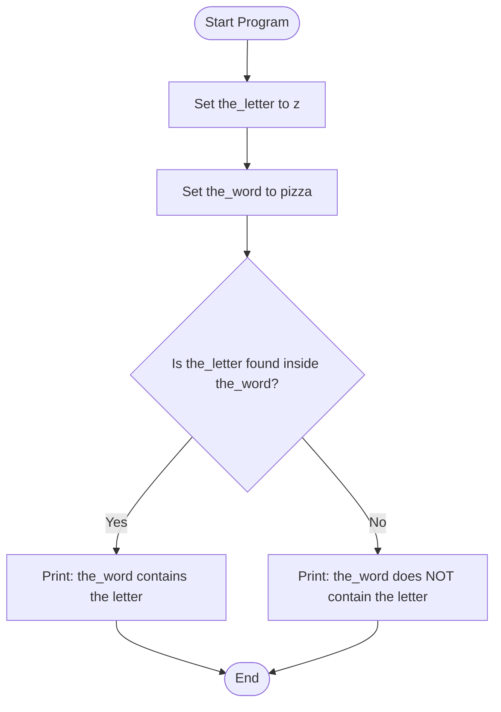
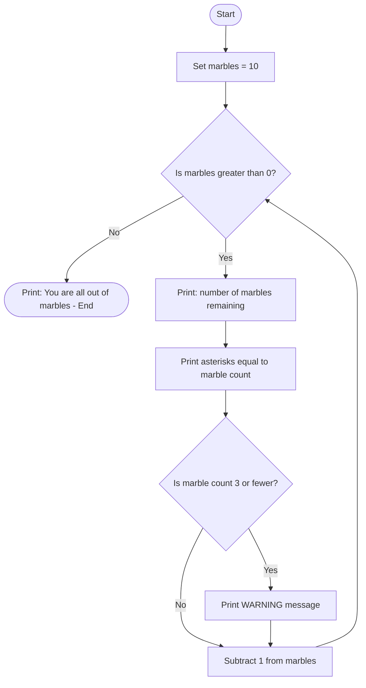
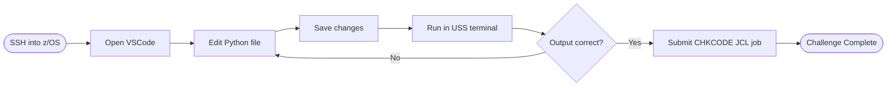
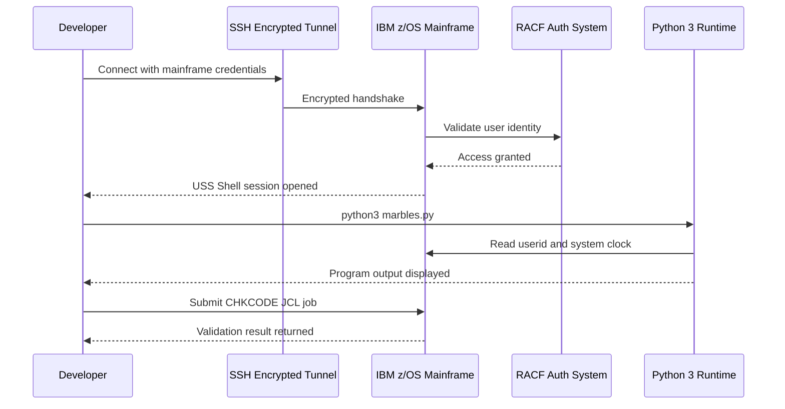
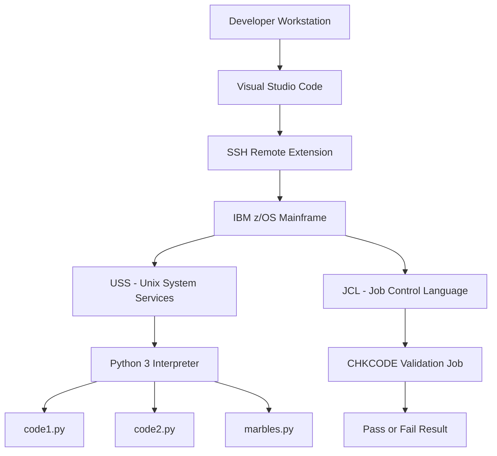
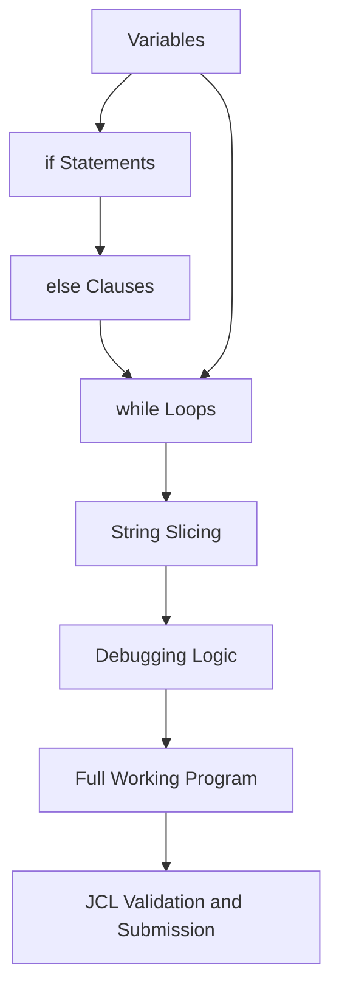
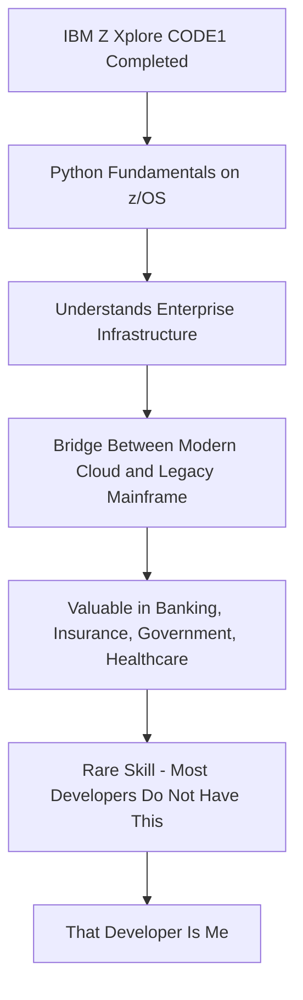

<div align="center">

# 🖥️ IBM Z Xplore — CODE1: Make Your Own Fun
### Python Fundamentals on an IBM z/OS Mainframe

[](https://ibmzxplore.influitive.com/)
[](https://www.python.org/)
[](https://www.ibm.com/products/zos)
[](/)
[](/)

> **Writing Python on one of the world's most powerful and secure computing platforms — IBM Mainframe (z/OS).** This is not your average "Hello World" exercise. This is enterprise-grade Python development on the same infrastructure that processes **$10 trillion in daily financial transactions** globally.

</div>

---

## 🤔 Wait — What Even Is a Mainframe?

Think of it this way: your laptop handles maybe a few dozen tasks at once. A **mainframe** handles **millions of transactions per second** — the kind of horsepower that runs your bank, your airline booking system, your hospital records. IBM's z/OS is the operating system powering these machines.

**The fact that I can write, debug, and deploy Python on one?** That is a rare skill that the vast majority of developers — even senior ones — do not have.

---

## 📋 Table of Contents

- [🎯 What This Project Is](#-what-this-project-is)
- [🏗️ The Environment Setup](#️-the-environment-setup)
- [📂 Programs Built](#-programs-built)
- [🔍 How the Programs Work](#-how-the-programs-work)
- [🗺️ Program Flow Diagrams](#️-program-flow-diagrams)
- [🔐 Security Features](#-security-features)
- [🛠️ Tech Specs](#️-tech-specs)
- [📊 Concepts Mastered](#-concepts-mastered)
- [🪜 Step-by-Step Journey](#-step-by-step-journey)
- [💡 Why This Matters to Your Team](#-why-this-matters-to-your-team)

---

## 🎯 What This Project Is

This is **Challenge CODE1** from the **IBM Z Xplore Fundamentals** certification track. The objective: write Python programs that run directly on an **IBM z/OS mainframe** — the backbone of global banking, finance, healthcare, and government infrastructure.

| 📌 Detail | ℹ️ Info |
|:---|:---|
| **Challenge** | CODE1 — Make Your Own Fun |
| **Platform** | IBM Z Xplore |
| **Operating System** | IBM z/OS (Unix System Services — USS) |
| **Language** | Python 3 |
| **Estimated Duration** | ~120 minutes |
| **Total Steps** | 12 |
| **Edition** | 240630-2221 |
| **Prerequisite** | VSC1 (VSCode remote connection to z/OS) |

---

## 🏗️ The Environment Setup

To run Python on a mainframe, you can't just open a terminal and type. The full stack looks like this:

```
Your Computer (Windows / Mac / Linux)
        │
        │   🔐 SSH — Encrypted Secure Shell Tunnel
        ▼
IBM z/OS Mainframe
        │
        ├── USS Shell  (Unix-like terminal running inside z/OS)
        ├── VSCode     (Connected remotely via SSH extension)
        ├── Python 3   (Interpreter running natively on z/OS)
        └── JCL Engine (Batch job submission & validation)
```

**SSH** acts like a private, encrypted phone line between your machine and the mainframe — every keystroke is secured end-to-end.

---

## 📂 Programs Built

| 📄 File | 📝 Description | 🧩 Concepts Used |
|:---|:---|:---|
| `code1.py` | System awareness script — reads userid, checks time, counts down from 5 | Imports, `time` module, loops, `os` module |
| `code2.py` | Letter detective — checks whether a letter exists inside a word | Variables, `if/else`, string membership test |
| `marbles.py` | Marble countdown simulator with visual asterisk output and low-marble warning | `while` loop, conditionals, string slicing, arithmetic |

---

## 🔍 How the Programs Work

### 🔢 `code1.py` — The System Hello

This was the first program to run. It demonstrates how Python can interact with the z/OS operating system itself.

```python
import os
import time

# Counts backwards from 5
for i in range(5, 0, -1):
    print(i)
    time.sleep(1)

# Reads your mainframe userid
print("Hello,", os.environ.get('USER'))

# Figures out what time it is
print("The time is:", time.strftime("%H:%M:%S"))
```

**Plain English:** "Count from 5 to 1, pause a second between each number, then greet the user by their actual mainframe login name and tell them the current time."

---

### 🔤 `code2.py` — The Letter Detective

This program checks whether a specific letter appears inside a given word — illustrating variables and decision-making.

```python
the_letter = "z"
the_word   = "pizza"

if the_letter in the_word:
    print(f"Yes! '{the_word}' contains the letter '{the_letter}'")
else:
    print(f"Nope. '{the_word}' does not contain '{the_letter}'")
```

**Plain English:** "Does 'pizza' contain the letter 'z'? If yes — say so. If no — say that instead."

> 💡 **The key insight:** Changing `the_word` from `"pumpkin"` (no z) to `"pizza"` (has a z) shows how one small variable change completely changes program behaviour.

---

### 🪩 `marbles.py` — The Marble Countdown (Main Program)

This is the centrepiece of the challenge — built step by step across multiple lessons.

```python
marbles     = 10
marble_dots = "**********"

while marbles > 0:
    print("There are", marbles, "marbles left")
    print(marble_dots[:marbles])        # Visual bar — shrinks each loop

    if marbles <= 3:
        print("WARNING: Running low on marbles!")

    marbles = marbles - 1               # Remove one marble

print("You are all out of marbles")
```

**Sample Output:**
```
There are 10 marbles left
**********
There are 9 marbles left
*********
There are 8 marbles left
********
...
There are 3 marbles left
***
WARNING: Running low on marbles!
There are 2 marbles left
**
WARNING: Running low on marbles!
There are 1 marbles left
*
WARNING: Running low on marbles!
You are all out of marbles
```

---

## 🗺️ Program Flow Diagrams

### `code2.py` — Decision Logic



---

### `marbles.py` — Full Countdown Logic



---

### Challenge Workflow — From Code to Validation



---

### Learning Progression Across 12 Steps

```mermaid
flowchart LR
    S1[Steps 1-2\nRun and Read code1.py] --> S2[Step 3\nVSCode Configuration]
    S2 --> S3[Steps 4-5\nVariables in code2.py]
    S3 --> S4[Steps 6-7\nif and else Logic]
    S4 --> S5[Step 8\nwhile Loops in marbles.py]
    S5 --> S6[Step 9\nDebugging Broken Logic]
    S6 --> S7[Step 10\nAsterisks Visual Output]
    S7 --> S8[Step 11\nFinal Message]
    S8 --> S9[Step 12\nSubmit and Validate]
```



---

## 🔐 Security Features

This project does not run on just any server — it runs on **IBM z/OS**, which has security baked in at every layer of the stack.

| 🔒 Security Layer | ⚙️ What It Does | 🎯 Why It Matters |
|:---|:---|:---|
| **SSH Encryption** | All traffic between your computer and the mainframe is fully encrypted | No one can intercept your code or credentials in transit |
| **RACF Authentication** | IBM's Resource Access Control Facility controls who can access what resource | Only authenticated, permissioned users can execute programs |
| **User Identity Binding** | `code1.py` reads the actual mainframe userid at runtime | Every action is tied to a real person — full audit trail |
| **JCL Batch Validation** | The CHKCODE validation runs as a controlled JCL job | Execution happens in a sandboxed, logged environment |
| **Hardware Isolation** | z/OS runs on dedicated mainframe hardware | No shared-VM attack surface — enterprise-grade isolation |
| **No Extension Risks** | Unnecessary VSCode extensions were intentionally avoided | Reduces the risk of third-party code executing on a secure system |

### Security Authentication Flow



---

## 🛠️ Tech Specs

### Full Platform Stack



### Component Breakdown

| 🧩 Component | 📋 Version / Detail |
|:---|:---|
| **Programming Language** | Python 3.x |
| **Operating System** | IBM z/OS (USS layer) |
| **Code Editor** | Visual Studio Code with Remote SSH |
| **Connection Protocol** | SSH — Secure Shell |
| **Validation Mechanism** | JCL (Job Control Language) batch job |
| **Authentication System** | IBM RACF |
| **Challenge Identifier** | CODE1 / 240630-2221 |
| **Certification Program** | IBM Z Xplore Fundamentals |

---

## 📊 Concepts Mastered

### Python Fundamentals Applied

| 🧩 Concept | 📄 Used In | 📖 What It Does |
|:---|:---|:---|
| **Variables** | `code2.py`, `marbles.py` | Named containers that hold data — numbers, words, anything |
| **`if` Statement** | `code2.py`, `marbles.py` | Makes the program take a different path based on a condition |
| **`else` Clause** | `code2.py` | Handles the outcome when the `if` condition is NOT true |
| **`while` Loop** | `marbles.py` | Repeats a block of code for as long as something is true |
| **String Slicing** | `marbles.py` | `marble_dots[:n]` — prints exactly `n` asterisks from a string |
| **Arithmetic** | `marbles.py` | `marbles = marbles - 1` — subtracts one per loop |
| **`import` Statements** | `code1.py` | Loads Python libraries like `time` and `os` |
| **Comments** | All files | Lines starting with `#` — ignored by Python, explain intent to humans |
| **Debugging** | `marbles.py` | Identifying and fixing a broken `if` condition (Step 9) |

### Why Each Concept Is Foundational



---

## 🪜 Step-by-Step Journey

| # | 📌 Step Title | 🔍 What Happens |
|:---:|:---|:---|
| 1 | **IF You Want to Code…** | SSH into z/OS, copy `code1.py` from `/z/public`, run it for the first time |
| 2 | **Let's See What's Inside** | Open the code in VSCode, read through imports, countdown loop, and userid reader |
| 3 | **A Word on Extensions** | Configure VSCode correctly — avoid extensions that break on z/OS Python |
| 4 | **A Rose by Any Other Name** | Learn what variables are by reading `code2.py` with `the_word = "pumpkin"` |
| 5 | **A Bit of an Anticlimax?** | Change `the_word` to `"pizza"` — program now outputs a result for the first time |
| 6 | **Blocks for the Better** | Understand `if` statements, colons, and indentation (the "blocks" of logic) |
| 7 | **Or Else!!** | Uncomment the `else` block — program now handles both letter-found and not-found |
| 8 | **Don't Lose Your Marbles** | Run `marbles.py`, understand how a `while` loop counts from 10 down to 1 |
| 9 | **The Final Countdown** | Enable and then **fix** a broken `if` condition — real debugging experience |
| 10 | **I'm a Visual Learner** | Add `print(marble_dots[:marbles])` — visual asterisk bar shrinks each iteration |
| 11 | **All Out of Marbles** | Add `"You are all out of marbles"` — once, at the end, after the loop exits |
| 12 | **Double-Check; Submit** | Run the `CHKCODE` JCL validation job from `ZXP.PUBLIC.JCL` — challenge complete |

---

## 💡 Why This Matters to Your Team

Here is the honest truth: **most developers have never touched a mainframe.** I have. And I did not just run someone else's script — I wrote Python from scratch on z/OS, debugged broken logic, and validated my work through IBM's JCL batch job system.

### What This Demonstrates About Me

| ✅ Skill | 💬 Evidence |
|:---|:---|
| **Mainframe Fluency** | Navigated z/OS USS, SSH authentication, and JCL submission — most devs cannot do this |
| **Cross-Platform Thinking** | Understood that Python is Python regardless of whether it runs on a laptop or a mainframe |
| **Debugging Under Constraints** | Step 9 required finding and fixing broken conditional logic — not just copy-pasting |
| **Security Awareness** | Operated in an environment where RACF, SSH tunnels, and audit trails are the baseline |
| **Enterprise Toolchain** | Used VSCode remote SSH, JCL batch jobs, and mainframe job monitoring together |
| **Structured Learning** | Completed a 12-step IBM-certified challenge with a time-boxed deliverable |

### The Bigger Picture



> 💬 *"The world runs on mainframes. The best engineers speak both languages — modern cloud AND enterprise iron. I speak both."*

---

## 🧠 Technologies Used


---

## 📜 Certification & Affiliation

This challenge is part of the official **IBM Z Xplore Fundamentals** learning path — a program created by IBM to bring modern developers into enterprise mainframe computing.

| Field | Detail |
|:---|:---|
| **Issued by** | IBM |
| **Program** | IBM Z Xplore |
| **Track** | Fundamentals |
| **Challenge** | CODE1 — Make Your Own Fun |
| **Edition** | 240630-2221 |
| **Copyright** | IBM 2021-2024 |

---

<div align="center">

---

**Built with 🐍 Python · Deployed on 🖥️ IBM z/OS · Validated via ⚙️ JCL**

*If you are building a team that needs someone who can bridge modern development with enterprise infrastructure — let's talk.*

---

</div>
